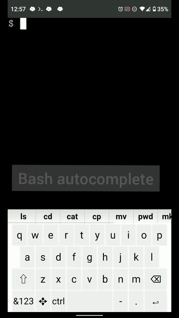

# Swell.sh

Swell.sh is a terminal for bash designed for use on mobile phone web browser, it comes with convenient features such as autocomplete suggestion and gesture typing keyboard.
It is useful for quickly troubleshooting server problems on the go, or in your bed in the middle of the night. If you occassionally use the SSH app on your phone, you may want to give Swell.sh a try!

<p align="center">
    <a target="_blank" rel="noopener noreferrer" href="demo.gif">
        
    </a>
</p>

## What is it?

Diagram:
```
+-------------+             +--------------+           +--------------+
|             |             |              |           |              |
|             |  WebSocket  |              |  spawn    | Bash process |
| Client Side +-------------> Server Side  +---------->+              |
|             <-------------+              |           |              |
| Browser     |             | Python       |  pty      |              |
|             |             |              +----------->              |
| Chrome /    |             | API & WS     <-----------+              |
| Safari      |             |              |           |              |
|             |             | Static File  |  ptrace   |              |
|             |             |              +----------->              |
|             |             |              |           |              |
+-------------+             +--------------+           +--------------+
```
Swell.sh is a client-server application that 1) spawns a Bash process and 2) opens a HTTP server. It allows users to connect to the server on their mobile browser, then they could interact with the Bash process via the Web terminal UI, kind of similar to using a SSH client App on your phone.

The difference is that the Web-based UI is designed to use on mobile phone and has a virtual keyboard built-into the app that gives features like autocomplete suggestion and swipe gesture (by utilizing information provided by the server process). Think of something like your phone's keyboard trying to suggest the next word you may want to type, but instead of natural language, now it suggests Bash's Tab completion. Take a look at the GIF above to see what it means.

**Table Of Content:**
<!-- START doctoc generated TOC please keep comment here to allow auto update -->
<!-- DON'T EDIT THIS SECTION, INSTEAD RE-RUN doctoc TO UPDATE -->


- [Features](#features)
- [Installation](#installation)
- [NOTE ON SECURITY](#note-on-security)
- [Limitations](#limitations)
- [Tmux support setting](#tmux-support-setting)
- [Termux support setting](#termux-support-setting)
- [FAQ, User Manual, Tips](#faq-user-manual-tips)
- [Acknowledgement](#acknowledgement)
- [Licence](#licence)

<!-- END doctoc generated TOC please keep comment here to allow auto update -->

## Features
1. Open-source & self-hosted
1. Web-based client, works on Chrome on Android and Safari on iOS
1. Autocomplete suggestion for commands and path names just like when you type Tab in Bash, works with Bash completion installed on the server (eg: git status, git log)
1. Swipe gesture input
    - support partial path so that you don't need to swipe the whole gesture for long commands, i.e., swiping 'user' would likely to suggest 'useradd', 'userdel', etc
1. Works for bash inside Tmux (See `Tmux support setting` below)
1. Works on Termux on Android (See `Termux support setting` below)


----

If you like the idea of this project and find it useful, please consider making a donation to support the continued development of Swell.sh [via PayPal here](https://www.paypal.me/wcchoi)

Commercial support/priority bug fixes/custom feature development are available, corporate sponsorship is very welcomed. Please contact via email (see Github Profile)


## Installation

#### Server-side
Requirements:

1. 64-bit Linux
1. bash
    - version tested: 4.2 - 4.4
    - the `bash` that comes with most Linux distros (eg: Ubuntu 16.04/18.04, Debian stretch 9.7, CentOS 7.6, Fedora 29 are tested) should work with Swell.sh, unless you've overridden the system default one with your own compiled version
1. python 3.6+, virtualenv, pip
1. `bash-completion` package - [https://github.com/scop/bash-completion](https://github.com/scop/bash-completion) (optional, but highly recommended, maybe pre-installed on your system but if not, could be easily installed from most distro's package manager)
1. `ptrace_scope` setting as follow:

    In order for Swell.sh to work properly, you have to configure your system's `ptrace_scope` to appropriate value. First check:  
    `cat /proc/sys/kernel/yama/ptrace_scope`  
    - If the value is 3, won't work ¯\\\_(ツ)\_/¯
    - If the value is 0/1, you are good to go. (but if it's 1 and you want to work with Tmux you have to read the section on that below)
    - If the value is 2, you can still make it to work by changing some setting (though it requires root once, but not for running Swell.sh) Please first check [https://www.kernel.org/doc/Documentation/security/Yama.txt](https://www.kernel.org/doc/Documentation/security/Yama.txt) for the implication of the modification. Either:
        - [***Recommended***] Add the capability `cap_sys_ptrace` to the python interpreter in your virtualenv, by:
        `sudo setcap cap_sys_ptrace=eip <path to python interpreter like venv/bin/python>`  
        (If you do not have setcap command, please google how to install on your system)
        - _OR_ Change the value back to 0/1 by entering a root shell (`sudo su`) then `echo 0/1 > /proc/sys/kernel/yama/ptrace_scope`

##### Install:
    git clone https://github.com/wcchoi/swell.sh
    cd swell.sh
    virtualenv -p python3 venv
    source venv/bin/activate
    pip install -r requirements.txt

##### Run:
    cd swell.sh
    source venv/bin/activate
    python app.py # default options: --host=127.0.0.1 --port=8010

#### Client:
1. Android Chrome/iOS Safari
    - navigate to `<HOST>:<PORT>`, you may need to turn on VPN connection/SSH port forwarding on your phone (see the security notes below)

## NOTE ON SECURITY

***Do NOT*** expose the server publicly on the Internet without proper authentication and encryption, use it behind a VPN/SSH port forwarding. Otherwise anyone who can access the URL could control your system.

If you plan on exposing the server to Internet, please run it behind a reverse proxy (eg: Nginx, Apache, Caddy), and configure HTTPS and basic authentication (NOTE: unfortunately Basic Auth for WebSocket does not work for iOS Safari, please use other methods) to encrypt the data traffic and limit access. You will need to set the listening interface (`--host` flag) to `0.0.0.0` as well when running `app.py`

Also, please note that Swell.sh itself is not using SSH protocol (it uses WebSocket to interact with a Bash process on the server via pty), and I am no security expert, so it's possible there are places in the code that do not follow the best/strictest security practice. If you have concern/doubt over that, please audit the code and all the third party dependencies and then decide yourself.

If you find vulnerabilities/places where security could be improved, please contact me via email for discussion. Thanks for the help!

## Limitations

These are the current limitations, some maybe fixed in future update. PR welcome!

- Server works on 64-bit Linux only
- Bash shell only (your login shell config on the system is ignored)
    - also the autocomplete suggestion works on the outermost bash (the one spawned by app.py) only, if you enter a new bash sub-shell, or SSH to other server, it won't work
- Client is only tested to work on the latest version of Chrome on Android and Safari on iOS (that I have access to), older/other browser may still work (some polyfills are applied), but YMMV
- Single-session only, i.e.: if multiple client devices are simultaneously connected, they will be looking at the same thing
- Keyboard is US QWERTY layout only
- Keyboard is single-touch only, so you CANNOT press-hold the CTRL key then tap C key to input CTRL-C, have to tap CTRL and then tap C
- Keyboard does not support some key yet, eg: F1/F2, Page-up/down, CTRL-]/CTRL-^, CTRL-ALT+X, etc
- The bug of autocomplete suggestion that sometimes it gives no/wrong suggestion (though you can still input a TAB key to trigger autocomplete just like on normal keyboard)
- Accuracy of the swipe gesture input may not be high
    - NOTE: currently the swipe gesture algorithm works best when the full/longer path is traced
- The PATH env var is not refreshed, i.e. the autocomplete suggestion would not detect change in PATH and add new executables for suggestions
- Possibly more... see Issue page


## Tmux support setting

NOTE: this section is NOT applicable to Termux on Android, see the section below

If you want the autocomplete suggestion to work for bash inside Tmux, please do the following:

- (you can skip this if your `ptrace_scope` is 0) Add the capability `cap_sys_ptrace` to the python interpreter in your virtualenv, by:

    `sudo setcap cap_sys_ptrace=eip <path to python interpreter like venv/bin/python3>`  
    (If you do not have `setcap` command, please google how to install on your system)

- Attach to the tmux session by this command:

    `tmux a -t <session name>`  
    NOTE: you have to attach to the tmux session using the above command in order for Swell.sh to work.  
    If you create a new session, please detach from it then re-attach to it using the above command. Otherwise the autocomplete suggestion bar will not update.

Tips: Adding `set -g mouse on` to your `~/.tmux.conf` to allow touch in Tmux, useful for switching between windows/panes

## Termux support setting

NOTE: Termux is only tested on the Android devices I have access to (Android Pie/9), and requires 64-bit device

Swell.sh could also be used as an alternative front-end for Termux Bash shell on Android

- Install `Python3`, `bash-completion` in Termux

    `pkg install python bash-completion`

    For `bash-completion` to work, please add `source /data/data/com.termux/files/usr/share/bash-completion/bash_completion` (actual path to `bash_completion` script maybe different on your device, you have to find that out) to your `~/.bashrc` (create one if not exist)

- Swell.sh depends on Android `libc.so`, if you get an error saying libc not found, please add the directory which contain the `libc.so` file to `LD_LIBRARY_PATH` by eg `export LD_LIBRARY_PATH=/system/lib64/:$LD_LIBRARY_PATH` in `~/.bashrc` (eg: `/system/lib64/`, you can find that directory path by looking at the rightmost column of the command `cat /proc/$$/maps | grep libc` in a Termux Bash shell)

- To install and run:

    Similar to above, wget/git clone the source repo into a directory, create a `venv` (On Termux, you can create virtual env by `python -m venv venv`), activate it, `pip install -r requirements.txt`, then run `python app.py`

    Then go to `localhost:<PORT>` in Chrome

- If you want to work with Tmux on Termux,
    - Attach to the tmux session by this command:

        `tmux a -t <session name>`  
        NOTE: you have to attach to the tmux session using the above command in order for Swell.sh to work.  
        If you create a new session, please detach from it then re-attach to it using the above command. Otherwise the autocomplete suggestion bar will not update.

The `setcap`/`ptrace_scope` in the above section does not apply to Termux

## FAQ, User Manual, Tips

##### Q: How to type Tab:
A: Swipe up from space bar

##### Q: How to quickly delete a word backward (like CTRL-W)?
A: Swiping left of Backspace key sends CTRL-W, useful for deleting the suggested word when none of the swipe gesture candidates are correct

##### Q: How to input arrow keys?
A: Swipe up/down/left/right the cursor key (✥) to input up/down/left/right respectively. If swiping down is not detected on your phone, you can also long press that key to input "Down Arrow". Tapping the key will input "Left Arrow"

##### Q: How to type Ctrl-C:
A: Click 'ctrl', when that key changes to 'CTRL' press the desired alphabet to input Ctrl+alphabet

##### Q: How to type ALT-C:
A: Click ⇧ (Shift) to switch layout to Uppercase, then click 'alt', when that key changes to 'ALT' press the desired alphabet to input Alt+alphabet

##### Q: how to change font size
A: Click a key 'T+'

##### Q: How to type Non-English text?
A: Click '…' Key then input in the text box using the mobile OS's keyboard 

##### Q: Programs like `htop`/`vim` are not using full screen space:
A: Try changing font size or running the `resize`/`resizecons` command, which could be obtained from `kbd` package on Ubuntu

##### Tips
- You can to set the Bash prompt to shorter for more space for typing the commands, by `export PS1='$ '`
- If you are using Android Chrome, you can use "Add to Home screen" (from the hamburger menu) to add a shortcut to the web app, this allows launching without the address bar to save more screen space


## Acknowledgement

See ACKNOWLEDGEMENT.md

## Licence

Copyright (c) 2019 Choi Wai Chung

AGPL version 3

